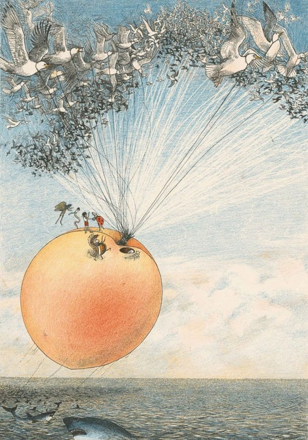

```{r, echo=FALSE, preview=TRUE, fig.cap="Image by Nancy Ekholm Burkert, no copyright infringement is intended. [Courtesy of Guardian News & Media Ltd.](https://www.theguardian.com/artanddesign/2019/aug/02/nancy-ekholm-burkerts-james-and-the-giant-peach)"}



```


```{r setup, include=FALSE}
knitr::opts_chunk$set(echo = FALSE)
```

One of my favorite children's books is Roald Dahl's 'James and the Giant Peach'. The story tells of James and his band of friendly charismatic insects on an adventurous journey across the Atlantic Ocean, inside a giant peach. In one of their adventures they are attacked by sharks, so they harness a flock of seagulls to carry the peach away to safety. As I search for innovative solutions to the global sanitation crisis, I find myself occasionally lifted away on flights of fancy, on a vision of equitable and inclusive sanitation; safe toilets for all people, everywhere. The challenge is so great, so intractable, I sometimes wonder if I would have better luck trying to tether a giant peach to a flock of seagulls. 

Roald Dahl penned his flying fruity frolic in 1961, 100 years after Bazalgette's sewer started to evacuate wastewater from London's toilets. Trying to climb into the mind and channel the genius of that great Victorian Engineer led me to asking; 'what was Bazalgette reading at the time?' and 'if he was alive now, would he do the same thing again?'. Lets try and answer that question in its 2 simplest forms: 

**1. Yes! of course he would do the same thing again.**

Sewers are absolute marvels of civil engineering ingenuity: Temples of shite! How we can bend and lift massive columns of wastewater with a well considered spatial arrangement of concrete & steel, iron & plastic, earth & water. Sewers come in all shapes and sizes and can be as big as a double decker bus, or small enough to get blocked by a tennis ball. Sewers can be as smooth as a baby's bottom, or as rough as the bark on a coconut tree. Sewers can be deep, shallow, or even run above the ground, depending on a myriad of technical, financial, social, and environmental factors... oh the joy of engineering sewers! Far beneath the Thames riverbed snakes London's new super sewer; the Thames [Tideway](https://www.tideway.london/). At a total estimated cost of £4bn, the mega-project broke ground in 2016 and is due for full completion in 2025. The sewer consists of a complex arrangement of tunnels and shafts which will prevent sewage from spilling into the Thames river, which flows through the heart of the UK's capital. So if we have the engineering expertise and if we can mobilise the finances, why shouldn't we build sewers? 

**2. No! of course he wouldn't. **

Sewerage that actually works is infrastructure for the privileged few. Non-functioning sewerage is more common; only 40%^[WHO/UNICEF JMP. https://washdata.org/data/household#!/dashboard/new. Accessed 2021-05-06.] of the world is connected to a sewer, but 80%^[United Nations World Water Development Report. https://en.unesco.org/themes/water-security/wwap/wwdr/2020. Accessed 2021-05-06] of wastewater discharged to the environment is untreated. In other words, having a sewer connection does not imply safe sanitation. Even more common is no sewerage at all, so-called 'non-sewered sanitation'; latrines and septic tanks. Then there are the billion people with access to neither sewered nor non-sewered sanitation; open defecation. These figures are our best estimates, but the reality is that we just don't know. Most cities don't have maps showing where there are latrines or septic tanks, and even London doesn't know where all of its sewers are. Even if we could locate all of these assets, we still don't know which ones are safe, and which ones leak. With the little data we do have, the prognosis is not good, with most sanitation systems globally protecting neither our environment nor our public health [@peal2020a]. We need more data, and we need long-term, institutionalized systems of data collection and analysis. 

Sewers are prohibitively expensive to build and operate for most of the world's population. Attempts to implement sewerage in low-income countries usually end in failure; households don't connect because the existing alternative is cheaper; sewers block, crack and leak if they don't flow with water or if they carry 'other'^[BBC NEWS. Belgravia fatberg: 'Disgusting' mass cleared from sewer. https://www.bbc.com/news/uk-england-london-54735988. Accessed 2021-05-21] types of waste; and wastewater treatment infrastructure at the end of the sewer is too expensive and too complicated to operate and maintain. 

"But wait a minute!" I hear you cry.... "London isn't a low-income city, and Bazalgette's sewers have been working for over a hundred and fifty years". True that, I say. Also, London's new super sewer will only be used during heavy rainfall, to intercept diluted sewage spills to the river Thames, so more like a long storm attenuation tank than a sewer. "But why are we flushing our water into sewers with looming water scarcity? Isn't there another way?"^[Thames Blue Green Economy Group. THE CASE AGAINST THE THAMES TIDEWAY TUNNEL. http://www.bluegreenuk.com/freewater/tbge/References/The%20case%20against%20the%20Thames%20Tideway%20Tunnel.pdf. Accessed 2021-05-06]. Well indeed, water scarcity is something that even 'wet' countries like the UK will have to deal with, but the argument could be flipped on its head if the wastewater from the super sewer could be treated and reused in agriculture or for industry [@heggie2020]. 

"So, what the hell is the point of this blog post?!" I hear myself think... Well, I suppose its to drive home the point that answering questions in simple forms belies the complexity and the nuances of the topic in a way which detracts from an open and humble search for solutions. The 'sewered v's non-sewered' debate which is now essential when considering new investments in sanitation infrastructure, must consider these complexities if is to contribute to informed and unbiased decision making. Will the super sewer provide London's people and its river with a future-proof solution? Only time will time. I for one hope that it will, but I also hope that the next mega-project required to address London's infrastructure needs, or those of any other city for that matter, will be one rooted in the principles of equity and inclusion, and will take more carbon out of the atmosphere, than puts it in. Perhaps, when we reach 2050 and we look back on a world which was cooler, this will be the main critique of our addiction to infrastructure; that we used too much concrete and steel, and the damage to our climate cannot be undone.

So I offer a third response; 

**3. Well obviously it depends, solutions are always context-specific. We need more data, more analysis, and an informed multi-stakeholder decision making platform. **
