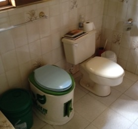

<script async defer data-domain="azores.io" src="https://plausible.io/js/plausible.js"></script>

```{r, echo=FALSE, preview=TRUE, fig.cap="Image from the movie ‘Wolf of Wall Street’ courtesy of Paramount Pictures. https://www.ft.com/content/4b67b618-deb4-11e9-b112-9624ec9edc59", out.width="100%"}


```

## Hello, I am a serial nutrient recycler. 

I pee on trees, and I sometimes pee on bushes too. It gives me a sense of enormous well-being to know that I am returning my nutrients to the soil where they may be put to use by nature.
 
I have discovered no term for my condition. The beautifully sounding 'Paruresis' (sounds better said slowly)  is not the name of a Greek Goddess or the latest wellness fad but is the term given for "shy bladder syndrome", the type of phobia in which a person is unable to urinate in the presence of others. ('Shy bowel syndrome' is given the only slightly less beautiful term 'Parcopresis', which I imagine is a real issue for those who live in crowded slums, with no toilet and no other choice than to defecate in the presence of others.)
 
First off, why the confession? Are there not more important things to blog about? Well, arguably, yes, but this blog is less about me and my habits and more about the world and its habits. You see, most of us 'manage our waste' (i.e. our pee, and our poo) on the other end of the 'resource recovery' spectrum, that is to say, we flush it down a toilet or (in the case of latrine users) we drop it into a hole, and it is not used by nature; its gone, its 'wasted'. Those of us who live in healthy, clean, safe, and inclusive societies (in sanitation terms) can have some confidence that our toilet 'offerings' or 'resources' (i.e. poo, pee, and the flush water which accompanies it) are appropriately managed and will not contaminate our environment or our water sources. If this is you, you should know that a) you and your safely managed sanitation system are in the minority, and b) your waste (although being safely treated before discharge back into the environment) is probably not recovered and re-used. If you are shocked and appalled and really really want to re-use your waste, the short answer is 'start peeing on trees! (but hold the poop!)'. The longer answer needs a mere three more minutes of your time.

Let's backtrack a little with some science and an important disclaimer: I am not advocating for widespread, 'willy-nilly', uncontrolled discharges of our urine into the great wide open (unless your local environment is truly 'wide open', and then you're probably OK to crack on/pee on!). There are some important nuances which even the most evangelical ecosan^[https://en.wikipedia.org/wiki/Ecological_sanitation] (ecological sanitation) activist and practitioner should be aware of. Here's my rough attempt at describing 3 of these nuances: 

1. Not all 'nature' will love your pee the same way. For example, many people peeing straight into a water body (unless out in the open sea) risks eutrophication and possible harm to aquatic species somewhere in the watershed, whilst high concentrations of your nutrients (I'm talking about your Nitrogen(N), Phosphorous(P) and Potassium(K), the same stuff you'll find in a bag of fertiliser) may not be appreciated by more delicate soils and plant life. 

2. Not all pee is the same. Pee from a dehydrated human after a marathon run (really yellow pee) is not the same as pee from a  sedentary office worker who has been chugging gallons of water all day (really clear pee, like water). Different concentrations of pee will act differently upon the receiving soil and vegetation - hence the general recommendation to dilute pee before application in the garden. 

3. Think about your 'micro-pee-zone'; who uses it? who sees it? who smells it? Peeing on strawberries and tomatoes that someone may eat is gross, don't do it, but peeing on a huge oak tree is probably fine. Peeing whilst waving with a friendly 'good morning!' to your neighbours over your fence might not bother you, but it might put them off their breakfast. You might get away with only a few raised eyebrows if peeing by the side of the autobahn on a 10hour road trip (remember to pull over safely), but peeing in the bushes in front of a McDonald's drive-through might evoke a different reaction from motorists. 

I was recently urged to reconsider these pee-time nuances whilst watering the plants in my (new, temporary) back garden. You see, I have until very recently been privileged by having my own, very private pee-zone where I peed with abandon on a small bamboo plantation, a coconut tree, and my own compost pile. In short, I was 'doing the earth a (liquid) solid'. But a few weeks ago, I took up a summer residence in one of North America's green and leafy urban neighbourhoods and I started to question my urinary practice: Am I as well hidden from my neighbours as I think I am? Are there local environmental laws in place to protect any fragile and shallow aquifer systems? Is this soil 'legit' in terms of its ability to receive and use my nutrients? My confidence in my ecological practice came crashing down when I started to consider the many environmental, socio-cultural and institutional aspects of what seems so natural to me. I started to reconsider my behaviour on a personal level, and also ask myself some important professional questions like: 

- As an ecosan practitioner and activist, whether designing individual toilets or entire sanitation systems, do I adequately consider what toilet users want? (After all, even the fanciest urine-diverting (UD) toilets can go wrong). 

- Do I really try to understand the deep-seated cultural norms around waste recovery and re-use before touting waste treatment technologies that favour re-use options? (perhaps I don't listen as well as I should because I enjoy peeing on trees too much); and 

- Is there a place and time for radical approaches to sanitation systems (e.g. resource recovery) which may not be 'in all places, all the time'? Are we confusing the essential public health narrative with unnecessary complicating factors driven by financial sustainability objectives such as 'increasing and diversifying revenue streams to cover waste treatment OPEX', when we should accept that waste treatment is a public service that requires some form of subsidy? Perhaps not all sanitation systems need to 'leapfrog to circularity; perhaps we need to remove people's shit from their neighbourhoods and neutralise the health threat without the obsession with compost, black soldier fly larvae, or faecal fuel pellets. This is a trade-off choice: Do we accept fundamentally broken ecological systems so that we can deliver services and protect public health, or do we insist upon 'looped' ecological systems even if this conflicts with human development in the short term? Or are there simple solutions like deep row entrenchment of faecal sludge, which avoid the trade-off choice and satisfy multiple objectives?

As I waved 'good morning!' to my neighbours before they hurriedly scurried off back into their house, I was reminded of a couple of behaviour change parables that provoked further reflection. I'll leave you with these two tales as a kind of thought experiment and wish you happy thinking! (And happy peeing!) 

## Tale 1: Two toiltes, one conscious choice

My family and I have never been a '2-car family', but we once had two toilets, and I'm pretty certain that made for more interesting dinner party discussions. Our 2 toilets were very different; one was a WC leading to a septic tank discharging to a ravine outside of our house; one was an 'Ekolakay'^[https://www.oursoil.org/what-we-do/sanitation/] urine-diverting container-based toilet with a weekly waste collection service from a local Haitian service provider. I preferred using the Ekolakay toilet because I knew that my contributions (I'm talking now about my my poop, I still peed in the garden in this scenario) would be transformed into nutrient rich compost which would help nourish and sustain Haiti's depleted soils, and that my monthly toilet subscription was contributing towards someone's living wage. I disliked using the WC because a) it would often clog and smell if we had no water or if we had plumbing issues b) it would drain, untreated (via an unmanaged septic tank) to a ravine where downstream users would bathe and children would play, and c)   	 
  	 	 
I found it less ergonomic than the taller Ekolakay toilet (I'm 6'4" tall). Fast forward to today, and we are no longer a '2-toilet family'. We rely exclusively on a single WC which does not have all of the ecological and economic benefits of our previous ecosan toilet. I use it whenever I need to, but when I do, I still harbour a desire for each and every one of my daily 'waste contributions' to make a positive difference to my local ecology, just like when I pee on a tree. To put it another way, I have changed. And, although I do not have an ecosan service provider to satisfy a change in my behaviour, I hope that one day I will again. For even more food for thought, try this:


```{r, echo=FALSE,fig.cap="Our two toilets in our family home in Haiti."}



```

Imagine if your toilet technology and local sanitation service provider were transformed into an ecosan, container-based sanitation (CBS) solution; what would be the biggest obstacle; providing the service (logistics, engineering, regulation, finance… ) or changing behaviour so that users accept a different kind of toilet interface (one where they may see more poop than they saw in a WC)? And what comes first; behaviour change or a new sanitation service? 

## Tale 2: The Wolf of Wastewater Treatment 

In the height of the swinging naughties, when I was at the peak of my powers as a designer of decentralised wastewater treatment works (WWTW) (I know, I know - sexy stuff), my colleagues and I would work very closely with environmental regulators in the UK to design and implement numerous WWTWs for our utility clients. These treatment systems were legally required to meet specific discharge standards according to where they discharged their treated effluent (e.g. a discharge into a small lake used for bathing would have more stringent requirements than a discharge into a large, fast-flowing river). The governing legislation was from the EU's Urban Waste Water Treatment Directive (UWWTD). When the specific effluent requirement became known (upon official publishing of a 'discharge consent'), a peculiar ritual would play out in our office, in one of two ways: If the discharge consent required nutrient removal, there would be a collective groan and a return to the drawing board because the design would now require more work, the treatment process would be more complicated, and the meetings with the regulator and other stakeholders would need to continue. If the discharge consent did not require nutrient removal, there would be a collective 'hurray' followed by widespread jubilation and the popping of champagne.

To put it differently, the requirement to remove nutrients from the waste stream was such a technical challenge and had such a significant impact upon our workload, our bottom line, and our exposure to project risk, that it became something we would rather avoid. How does that story sit with you? Looking back, I find it both funny and interesting, but also slightly grotesque and dated. Whatever you choose your take-home message to be, here's a final thought experiment to wrap things up: 
 
Imagine a future cadre of sanitation professionals with a future reaction to legislation on nutrient recycling: Instead of cheering on the news that nutrients need not be treated, removed, or recycled, they hang their heads and weep. They weep because their world has been irreparably damaged by practices that waste our resources and destroy our aquatic environment. They weep because they have the skills and the technology to capture and recycle the nutrients in our waste stream, but their government legislation does not require them to use those skills or those technologies. They weep because they know they could do better, but their world doesn't care. 
 
Which world are we creating with our pee, with our poop? 