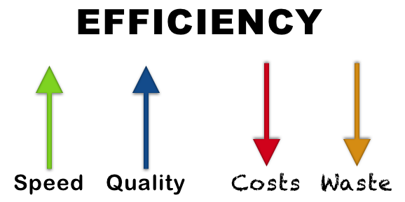
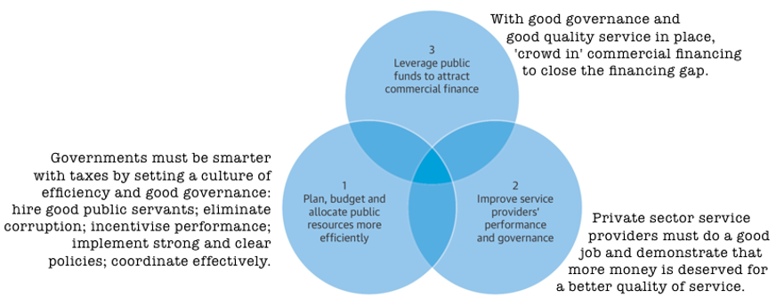
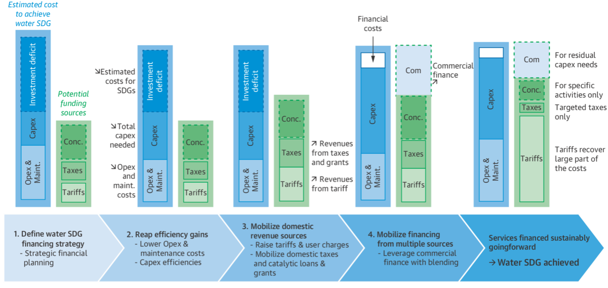

<script async defer data-domain="azores.io" src="https://plausible.io/js/plausible.js"></script>

```{r, echo=FALSE, preview=TRUE, fig.cap="Image created by Anthony Kilbride (CC-BY 4.0)", out.width="100%"}



```

International Development has an efficiency problem. Too much money is spent, whilst not enough impact is realized. Nuances abound, of course, but I can comfortably single out the sanitation sector (the SDG 6.2 sector) as having a poor track record when it comes to impact. I am not alone^[https://blogs.worldbank.org/water/how-improve-water-sector-financing-developing-countries]. If you work in the sanitation sector as I do, or even the broader ‘WASH’ sector, you know exactly what I am talking about. This blog is about efficiency and how to achieve it. Note that I’m referring to efficiency with a ‘big E’, so we’re not talking pump curves or project management here, (although they certainly play their part in the big picture), but rather this blog is about the efficiency of financing (getting the money) and procurement (spending the money).  

A definition of efficiency would be a good place to start. I like this one: Efficiency is the opposite of waste. This definition is useful because, whereas efficiency can take on a sophisticated academic form (especially when wielded by economists), waste is more visceral, you know it when you see it. It could be the fleet of parked white Landcruisers with air conditioners blasting while the boss is in the field: waste. It could be consultants A, B, and C, who are tasked by donors X, Y, and Z, to ask the same questions of the same local stakeholders: waste. Or it could be the investments in infrastructure which are not, and may never be, fit for purpose: waste. It’s obviously a problem, so no debate is needed there, but why does it persist? And how can we change? 

Let’s call on some economists to get their answers. We’ll start with the 2010 OECD publication "Innovative Financing Mechanisms for the Water Sector"^[https://sswm.info/sites/default/files/reference_attachments/OECD%202010%20Innovativ%20Financing%20Mechanisms%20for%20the%20Water%20Sector.pdf] which makes the case for innovative financing 'to increase the attractiveness of the WASH sector to providers of commercial finance'. Essentially, the document calls on commercial finance to close the financing gap ^[https://openknowledge.worldbank.org/bitstream/handle/10986/26458/114545-WP-P157523-PUBLIC-SWA-Country-Preparatory-Process-Discussion-Paper-8-Mar-17.pdf]. The keyword here is innovation. Next up is the 2017 World Bank publication "Easing the Transition to Commercial Finance for Sustainable Water and Sanitation"^[http://documents1.worldbank.org/curated/en/182521503466225465/pdf/119048-WP-REPLACEMENT-PUBLIC.pdf]. It proposes a framework with 3 components, shown in the image below, and summarized succinctly as follows: It’s not just about getting more money into the sector; it’s about using the money efficiently. The keyword here is efficiency.

```{r, echo=FALSE, fig.cap="Water Supply and Sanitation Financing Framework. Adapted from [World Bank. 2017. Easing the Transition to Commercial Finance for Sustainable Water and Sanitation. World Bank, Washington, DC.](https://documents1.worldbank.org/curated/en/182521503466225465/pdf/119048-WP-REPLACEMENT-PUBLIC.pdf)", out.width="100%"}



```

Finally, the 2016 World Bank document "Financing Options for the 2030 Water Agenda"^[https://openknowledge.worldbank.org/handle/10986/25495] proposes 5-steps, to break out of the unsustainable status quo, and balance the books whilst providing inclusive water & sanitation. The 5 steps are shown in the image below and are summarized here: 

1. Starting point. Estimate cost & revenue, define strategy. 
2. Reap efficiency gains. Reduce OPEX through efficient practices, systems, and technologies. 
3. Maximize existing revenues. Increase household investments, tariffs, taxes, transfers, and concessional finance.
4. 'Crowd in' commercial finance. Blend public and private finance after demonstrating profitable business models. 
5. Achieve SDG6 by balancing the books: CAPEX + OPEX = Revenues & loans.


```{r, echo=FALSE, fig.cap="Water Supply and Sanitation Financing Framework. Adapted from [World Bank. 2016. Knowledge Brief. Financing Options for the 2030 Water Agenda](https://openknowledge.worldbank.org/bitstream/handle/10986/25495/W16011.pdf?sequence=4&isAllowed=y)", out.width="100%"}



```

So there we have it, a roadmap to SDG6: Innovative finance coupled with efficient procurement and service delivery. Put differently, it’s not about 'throwing money at the problem', it about using that money efficiently. It’s about first plugging financial holes (addressing waste), and then closing the financing gap. It makes sense to me, but I dislike the onus placed upon recipient governments to do better, as if the problem starts there. If some institutions (the development banks, the WASH BINGOs) are asking governments and service providers to pull their socks up and do better, then there is first some honest reflection needed. My own experience is that governments in low-resource settings are often not as inefficient as the donors trying to help them (see Azores blog #2). If you are a donor advocating for greater innovation and efficiency, then you must lead by example and get your own house in order first. 

So what are we waiting for? What is the missing piece of the puzzle? How do we achieve better efficiency? The answer, I believe, is greater inclusivity. 

Inclusivity means deliberately bringing in others who are normally excluded. Let’s be careful here, the trap for the – as yet un-decolonised – WASH sector, is to view inclusivity through a saviour lens. It should instead be a call to action which transcends sectors, silos, and job descriptions: ‘You are needed!’ You, the innovators who dare to dream; you, the catalytic philanthropists who seed those dreams; you, the entrepreneurs who take on risks and try anew; you, the service providers who are the lifeblood pumping through your sanitation system; and you the public institutions who provide the vital organs of a sanitation system. A call for inclusion is a call for all stakeholders to take on the responsibility to act, share, and progress together. 

So, whether you are pursuing inclusive sanitation for a city (CWIS)^[https://www.worldbank.org/en/topic/sanitation/brief/citywide-inclusive-sanitation] or a Lake (LWIS)^[https://blogs.worldbank.org/water/protecting-lake-victoria-green-resilient-and-inclusive-future] or a village (CLTS)^[https://www.communityledtotalsanitation.org/page/clts-approach], inclusivity means we are all stakeholders, and we all have a role to play. What that role is will be different for every single sanitation system in the World. For example, a Mother in one country may need to carry her baby and her family’s water for 2 miles every day whilst lobbying her local representative for community action on public health issues like latrine access. A Mother in another country may only need to pay her utility bill, completely ignorant of the centuries old debt which has been accrued servicing the public infrastructure which allows her toilet to flush. These two examples demonstrate the inequality of our system of global health, and the much greater burden of responsibility, for citizens with deficient sanitation systems.

Inclusivity was the call made by the indigenous tribes of Amazonia at COP26^[https://www.youtube.com/watch?v=GpIkuJ7EZKk] who said *“We are looking for recognition of our communities... we are asking for funding to go directly to the community-based organsiations so that we can benefit... our work is limited if we don’t have a budget”* In other words; where is the money we deserve? and how do we get it? If we want to reap efficiency gains, embrace inclusivity! 

Inclusivity was the recent call made in The Cape Town statement^[https://www.nature.com/articles/d41586-022-01604-3], by researchers from low- and middle-income countries who want to become equal partners in international projects. Lyn Horn at the University of Cape Town exposes the core of the problem when she says, *“Even people and funders with very good intentions perhaps don’t understand how entrenched some of their practices and processes are”*. Being truly inclusive is difficult when we can’t even see how far we are from it. 

Inclusivity is the call made by The Sanitation Innovation Fund, who are supporting sanitation innovators in East Africa through the [Lake Victoria Pooptank](https://www.pooptank.net/home). The pooptank aims to get money and technical support into the hands of sanitation innovators who are living and working on the front lines of the global sanitation crisis. The Sanitation Innovation Fund is complementing ongoing efforts by others who share in the vision for Lakewide Inclusive Sanitation (LWIS) for Lake Victoria. It’s a small contribution to a big challenge, but it has inclusivity at its core. 

Rooting out waste in International Development will be a hard-fought battle. There are vested interests and institutional inertia which will take more than a handful of changemakers and some enlightened donors to dislodge. But dislodge it we must. Efficiency is our goal, inclusivity is how we get there. 

For practical examples of innovations in inclusive sanitation, [please tune in and show your support for the Lake Victoria Pooptank on the 19th of July](https://www.pooptank.net/for-audience). Join the movement to change how we deal with our waste; both kinds. 

Register here: https://www.pooptank.net/for-audience

