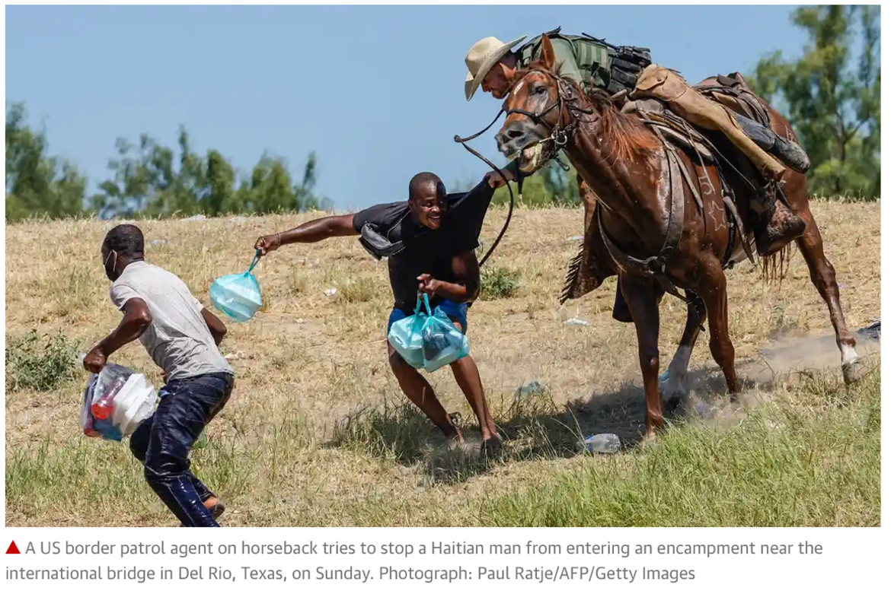

<script async defer data-domain="azores.io" src="https://plausible.io/js/plausible.js"></script>

```{r, echo=FALSE, preview=TRUE, fig.cap="Photo: Paul Ratje/AFP/GettyImages", out.width="100%"}



```

Some articles leap onto the page whilst others take months of research, rumination, and maturation. This article on Haïti has been months in the making because of all the above reasons, but principally because each time the writing nears some semblance of completion, Haïti is again struck by disaster and I am thrown backwards, asked to reconsider the purpose of my narrative and its relevancy to current affairs. For context, here is a reminder of Haïti’s recent disasters (or at least the ones which made front page news): 

- 7th July 2021: Haïti’s president Jovenel Moïse is assassinated in his home in Port-au-Prince. 
- 14th August 2021: An earthquake^[https://reliefweb.int/sites/reliefweb.int/files/resources/UNICEF%20Haiti%20Humanitarian%20Situation%20Report%20No.%207%20%28Earthquake%29%20-%2014%20October%202021.pdf] strikes the South of Haïti, killing over 2,200 people and destroying over 100,000 houses.
- 20th September 2021: The escalating humanitarian crisis for thousands of Haitians sheltering beneath a bridge on the US-Mexico border reaches its climax as US border patrol agents on horseback^[https://www.theguardian.com/us-news/2021/sep/20/us-begins-deportation-flights-haitians-texas-border-town] round up Haitian migrants.
- 16th October 2021: 17 missionaries (including 5 children) are kidnapped^[https://www.nytimes.com/2021/10/17/world/americas/haiti-missionaries-kidnap.html] by the armed gang ‘400 Mawozo’ in Port-au-Prince. 

That’s at least one major news story a month for the past 4 months, not at all bad media coverage for ‘the poorest nation in the western hemisphere’^[https://www.latimes.com/opinion/story/2021-10-10/the-west-owes-a-centuries-old-debt-to-haiti] whose status quo is disaster. These 4 sensational stories which piqued the media’s interest crown a much deeper misery and a more intractable set of problems. They deserve another reading with a broader lens, for context: 

- The assassination of Haïti’s president Jovenel Moïse in July was a barbarous crime for which, at the time of writing this article, the perpetrators and their supporters remain unknown and unpunished. That the Haitian courts seem paralysed to bring about ‘Jistis pou Jovenel’ (justice for Jovenel), is a tragic part of his own legacy. A deeply unpopular president, Jovenel’s administration was marred by continued corruption^[https://internationallawsection.org/wp-content/uploads/2021/10/IL-2021-Fall-Final.pdf], insecurity, and anti-Jovenel demonstrations. He eroded the fragile trust of the Haitian people in their state institutions through a series of unconstitutional acts, before finally ruling by decree^[https://www.france24.com/en/live-news/20210222-haiti-s-president-defends-record-at-un-us-slams-rule-by-decree]. Politically motivated assassinations have long been a staple of Haitian politics; Monferrier Dorval, Haïti’s most distinguished lawyer, was assassinated a year before Jovenel after publicly criticizing his government. Hamlet’s Denmark was far less rotten than the modern Haitian state^[https://sgp.fas.org/crs/row/R45034.pdf?utm_source=npr_newsletter&utm_medium=email&utm_content=20211001&utm_term=5819359&utm_campaign=money&utm_id=46765242&orgid=305&utm_att1=money]. 

- The survivors of the earthquake in August were less fortunate than those of the larger Port-au-Prince earthquake 11 years before, for several reasons. First, they were, and they remain, remote and inaccessible; far from the logistics hub and ‘interest center’ of the capital, and difficult to reach by helpers and journalists alike. Second, the essential humanitarian convoys mobilized in the days, weeks and months afterwards were harassed, robbed, and obstructed by the gangs controlling the roads from the capital to the earthquake zone. And third, their plight was dislodged from the headlines after just one day; on the 15th of August 2021, ‘the fall of Kabul’ marked the day America officially lost its War on Terror; a much bigger story. For those who were lucky enough to hold on to life, the triad of inaccessibility, insecurity, and indifference fixed their status as ‘surviving’. Surviving is what Haitians do. The lives of Haïti’s 99% continue to be defined by daily struggle; infant deaths caused by preventable diseases such as diarrhea; inaccessible and mediocre education from primary school to university; unavailable (soon to be non-existent^[https://www.msf.org/shortages-fuel-water-threaten-medical-care-haiti]) healthcare; and a daily hustle filled with the anxiety of living in a state without law. The truth is that by most measures of ‘normality’, a day in the life of a Haitian is an emergency. By showing us their courageous humanity and million megawatt smiles, we can sometimes be lead to believe that all is well on Haïti’s streets and mountains, but as the song ‘Lamizè Pa Dous’^[https://www.msf.org/shortages-fuel-water-threaten-medical-care-haiti] goes; “misery is not sweet, I will find life somewhere else”.

- The migrants rounded up on horseback and rejected from the USA in September were searching for another life, but they were sent back to Haïti, some of them in shackles^[https://www.theguardian.com/global-development/2021/sep/26/they-treated-us-like-animals-haitians-angry-and-in-despair-at-being-deported-from-us]. Most of them abandoned their home years ago, many having fled from Haïti to Chile^[https://reliefweb.int/report/chile/chile-oasis-haitians-has-begun-run-dry] when that migration route opened up in 2014. They return to find their country in a much worse state than when they left, and logically, they will renew their plans to escape. No-one can blame them. The Haitian children^[https://reliefweb.int/report/haiti/nearly-170-children-expelled-back-haiti-us-and-cuba-one-day] who risked perilous seas, child trafficking, sexual exploitation and abuse return to Haïti to meet broken schools and malnutrition^[https://www.unicef.de/blob/248678/ae5159bb395cad091b31cec6e6c14e3b/fed-to-fail---full-report---child-nutrition-report-2021---final-data.pdf]. The World Bank’s ‘Human Capital’ project^[https://www.worldbank.org/en/publication/human-capital#firstLink01632] is an attempt to quantify the effects of the stunted development that awaits them, it states; “A child born in Haïti today will be 45 percent as productive when she grows up as she could be if she enjoyed complete education and full health.” In other words, Haitian children will reach less than half of their potential. What parent would allow that? Migration is the obvious solution to the challenge of being Haitian-born. 

- Until the kidnapping of the 17 missionaries in October, over 700 Haitians were kidnapped in 2021, with children representing almost a third of them^[https://news.un.org/en/story/2021/10/1103852]. Kidnapping is a growth industry in Haïti, emblematic of the escalating power of the gangs, and exacerbated by a complete lack of trust in the state authorities including the Haitian National Police. The uncomfortable truth about this story is that it took the kidnapping of 17 white American missionaries for the World to know about the problem. It takes sensational stories for us to be reminded of Haïti’s unbroken agony: Haitian earthquake victims to show the normalization of poverty; Haitian migrants rounded up on horseback to show that freedom is not universal^[https://www.amnesty.org/en/documents/amr36/4920/2021/en/]; and 12 bullets in the body of a President to expose the fragility of Haïti’s democracy. 

With some understanding of these four headlines and the circumstances that created them, we are still barely scratching the surface of the troubles that afflict Haïti. The proud nation that gave the World the only successful slave rebellion^[https://en.wikipedia.org/wiki/Haitian_Revolution] and the first independent black republic, has for over two centuries since its creation been reduced to the ‘poorest nation in the western hemisphere’^[https://www.latimes.com/opinion/story/2021-10-10/the-west-owes-a-centuries-old-debt-to-haiti]. Haïti’s recent slew of tragedy has been so overwhelming that I find myself reaching, sloppily and tactlessly, for that old saying: ‘you couldn’t make this shit up’. A less crude descriptor of Haïti’s history is the title of Randall Robinson’s 2008 book on Haïti “An Unbroken Agony”^[https://www.hachettebookgroup.com/titles/randall-robinson/an-unbroken-agony/9780465070534/]. It accurately sums up the country’s fortunes and its people’s fate: disaster after disaster, agony upon agony, with no respite. 
How easy it can be, where Haïti is concerned, to give up all hope. 

I am not in the business of giving up hope, although when it comes to Haïti, my spirit sails dangerously close to the shore of surrender, and my mind often wanders the dark corridors of desperation. However, I do take comfort in clarity on one issue: It is crystal clear to me ever since I started working in Haïti in 2010, that the country will only advance with strong Haitian leadership and strong supporting factors; local governance, local capacity, and local education. Education must be the foundational tool of Haïti’s revival. 

The insistence on locally led solutions is not new for Haïti or any other nation, regardless of where they sit on the development scale. Across the spectrum of actors who stand in solidarity with Haïti, whether they are addressing immediate humanitarian^[https://www.miamiherald.com/article255278181.html] needs, or longer term development^[https://www.devex.com/news/opinion-afghanistan-and-haiti-2-countries-with-too-much-in-common-100635] assistance, the calls for local leadership are universal. Even USAID^[https://www-brookings-edu.cdn.ampproject.org/c/s/www.brookings.edu/blog/future-development/2021/09/29/usaids-local-staff-are-an-overlooked-resource-to-advance-locally-led-development/amp/], who are not exactly known as a bastion for local peoples’ empowerment, preferring to give their money to the ‘beltway bandits’^[https://cepr.net/where-does-the-money-go-eight-years-of-usaid-funding-in-haiti/], are now recognizing that they must do more to put the interests of local stakeholders first, with more local co-creation of programs, and more financing for local organisations. Reconfiguring the role of USAID, The World Bank, and other donor agencies is central to any sustainable nurturing and scaling of home-grown talent and solutions. Haïti will remain propped up by foreign aid for decades to come, and so it is in the nebula of International Development that we must start investigating why the majority of Haïti’s children remain uneducated, and why the majority of Haïti’s adults remain without sustainable livelihoods. I also have clarity on this issue. The system of International Development, whilst having noble objectives, is ill-designed to deliver on those objectives: the system is broken. 

Amongst the many opinion pieces on Haïti over the past 4 months of tragedy, this one from Haïti’s prominent newspaper ‘La Nouvelliste’^[https://lenouvelliste.com/article/231027/en-haiti-la-vraie-catastrophe-nest-pas-celle-que-vous-croyez], best describes the impact of this system: “it is not natural disasters that do the most damage in Haïti, but rather broken promises and large-scale plunder.” As if to prove the point that the system of International Development is broken, the failures of Haïti and Afghanistan were exposed simultaneously for all the world to see. Neither country offers a foundation for peace & prosperity; clean water, safe sanitation, basic education, or a stable business environment, because neither country has reliable governance through strong trusted institutions. Strong trusted institutions should be strengthened by outside influence, but in Haïti the opposite has been true. Whether undermining democratic elections^[https://nacla.org/news/2011/12/22/us-double-standard-elections-latin-america-and-caribbean] or orchestrating water & sanitation provision using top-down development principles^[https://www.youtube.com/watch?v=5hP1RF-TgB8], the International Community, usually led by the USA, has a very poor track record. Similarly, the Haitian government has mimicked the inefficiencies of its international donors, by implementing projects in a vacuum of planning, and embezzling funds meant for public projects^[https://www.france24.com/en/20200817-petrocaribe-scandal-haiti-court-accuses-officials-of-mismanaging-2-bln-in-aid]. 

Despite the criticism, ‘turning off the tap’ of foreign assistance is not an option. It is critical that a revamped system of International Development supports Haïti’s institutions so that they can build a foundation to provide basic services to their citizens. ‘Building Back Better’ is a phrase I first heard after Haïti’s 2010 earthquake. The meaning then was literal; the bricks and mortar of earthquake-proof housing. ‘Building Back Better 2.0’ must go deeper than that, its foundation is social justice, its bricks are education & livelihoods, its mortar, governance. Building Back Better 2.0 will also need to deliver the transformational change required for Haïti to meet the untamed climate monster year after year after year. Behind only Puerto Rico and Myanmar in terms of climate vulnerability^[https://reliefweb.int/sites/reliefweb.int/files/resources/Global%20Climate%20Risk%20Index%202021_1_0.pdf], Haïti’s infrastructure investments will protect neither its environment nor its citizens unless they are accompanied by the necessary strengthening of its institutions. These Haitian institutions must be chock full of local talent which takes pride in delivering quality services like water and sanitation, health, and education. These Haitian institutions, if strong and trusted, will steer the country upon a sea of climate risk and forge the social contract between the state and its citizens. Revitalizing Haïti without them will be like straightening deckchairs on the titanic, spitting in the ocean, or pissing in the wind. These Haitian institutions will need help, they will need money, and this money has a name; reparations. 

Any modern Haitian story is incomplete without the ethical call for reparations, and an understanding of ‘the greatest heist in history’^[https://theconversation.com/when-france-extorted-haiti-the-greatest-heist-in-history-137949], which saddled Haïti with 150 million francs of debt from 1825 to 1947. The 150 million francs was the cost of France recognizing Haitian independence, and to repay the French colonists for their lost slaves. Let that sit for a moment or two; formerly enslaved people were forced to compensate those who had once enslaved them. The message to ‘pay the debt’ was delivered down the barrel of a gun, or to be precise, 14 brigs of war carrying more than 500 cannons. Haïti chose to not re-engage in a war with France, signed the paper, and was locked in to 122 years of debt repayment; the price of freedom. As Europe and the United States eventually hurtled forwards through economic growth and industrialization, Haïti took out loan after crushing loan and became the failed state it is today. What happened to Haïti’s money for education? healthcare? public infrastructure? You can see it glistening in marble and gold if you stroll along la Seine on a sunny day in Paris, as you reflect upon the racial wealth gap which still straddles the old transatlantic slave route. It’s hard to argue against reparations for Haïti’s case, which in today’s money, would come to US$28 billion^[https://lenouvelliste.com/article/211316/au-minimum-la-france-devrait-rembourser-plus-de-28-milliards-de-dollars-americains-a-haiti-aujourdhui-soutient-le-celebre-economiste-francais-thomas-piketty], or 3 years of Haïti’s GDP. Its harder to agree on where the money should come from. France certainly doesn’t have the monopoly on fiscal cruelty towards Haïti, the United States^[https://www.npr.org/sections/money/2021/10/05/1042518732/-the-greatest-heist-in-history-how-haiti-was-forced-to-pay-reparations-for-freed?t=1637777185964] took on the role of egregious debt collector before, during, and after its violent occupation of Haïti in the early 20th century. Hardest of all however, would be to spend any reparations fairly and productively, without it all falling victim once again, to broken promises and large-scale plunder. 

Reparations through education would be a good place to start. If Haïti’s own education system is broken now, then rewarding talented Haitians with visas and scholarships to study abroad is the obvious solution. Let them see what the world looks like on the other side of the racial wealth gap, and then bring them back into strong local institutions where they can be nurtured into champions for social justice. Accepting Haitian refugees on the border with Mexico and enrolling them in local schools is the bare minimum that the USA could do with regards Building Back Better. A longer-term local education solution is also available from the USA, France and Canada in the form of the one million members of the Haitian diaspora. Leveraging the multiverse of professionals from their ranks can swell the numbers of Haïti’s training cadre to deliver homegrown education and training for children and adults, all in their own language of Creole. Haïti is bursting at the seams with smart solutions like these, all the International Community must do, is listen and empower. 

Whatever Haïti’s chosen route to progress, no advancements will be made without a functioning legitimate government, most likely preceded by an interim President leading a transitional council^[https://theglobalamericans.org/2021/10/adrift-us-haiti-policy/]. Haïti’s past experiences with transitional governance suggest at least another 2 years of violence, frustration, and a standstill on development. During that time, the migratory reality for Haitians is one of tout pòt femen (all doors closed). With nowhere to go, isolated within a closed system, Haitians will have no outlet, and their country will continue to implode. 

Today, as for two centuries ago, a tiny island in the Caribbean sends shockwaves around the World. Haïti reminds us that the price of privilege, is also the cost of misery. Haïti holds up a mirror to our conscience, looks deep into our souls, and asks us to measure the depth of our humanity. If Haïti means anything to our world, then it is our moral duty, to help it. 


