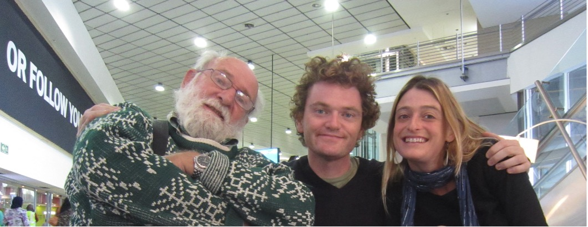

<script async defer data-domain="azores.io" src="https://plausible.io/js/plausible.js"></script>

```{r, echo=FALSE, preview=TRUE, fig.cap="With Peter Morgan (Father of the Arborloo) in Johanesberg airport: Organic chicken."}



```


```{r setup, include=FALSE}
knitr::opts_chunk$set(echo = FALSE)
```

Amongst the most shameful incidents in my young adult life was when I ate 200 ZAR worth of Kentucky Fried Chicken in Johannesburg airport. For those unfamiliar with KFC's rand valuation in 2012, thats a lot of chicken!: A couple of large 'buckets' of fried chicken, with the full accomplishment of beans, fries, fried beans, and what ever else they could cram in the bucket. There must have been some coke involved too, or sprite. The shame stills wells up inside me, nearly a decade later. 

Looking back, I cannot believe I was exercising free will. I was extremely jetlagged, hungry (admittedly not that hungry) and lured into dropping my guard by the 200R food voucher 'redeemable only in KFC, O.R.Tambo International Airport'. The voucher was all the compensation offered to us for a 14hr flight delay. We pleaded with the airline representative for something more nourishing, more green, more wholesome, less fried. But no, a blanket KFC compensation policy was in place; we were butting up against the uncompromising sheer might of 'the system', and the system won. Placed before the capitalistic chicken trough, I was helpless in defeat. Over the course of the next 14 hours, as calorific intake turned to fat, I wept at my weakness, and I vowed never to patronize KFC again. I am, 9 years on, proudly still, 'KFC-sober'.

I was reminded of this story recently when helping a Haiti-based NGO to develop their WASH strategy for the next 10 years. They explained their position to me; 

> "our effort so far has been more like a 'McDonald's' approach to development aid, whereas where we want to be is more like a 'farm to fork' organic approach."

> "Like a nice wholesome rotisserie chicken as opposed to KFC?" I quipped, as nine years of buried shame erupted inside me. 

> "Yes, definitely not KFC", came the response. 

What?! Do they know?! Were they there, on that day, hiding behind the oversized cardboard cutout of an anthropomorphized chicken?! 

Joking aside, whilst I have come to terms with most of the dodgy nutrition decisions I made under duress, I struggle greatly with the KFC-approach to delivering overseas aid that still defines much of the international development sector. I feel genuine, visceral, hang-your-head, daily shame at the wasteful and unjust practices which define the aid industry. I speak with authority on the subject of international development in Haïti because I live and breathe it; its chicken-fried stench surrounds me. If you work within it as I do, no amount of superficial spending or scrubbing can cleanse the systemic mire. The truth is undeniable if you know where to look and who to ask. For the people of Haiti however, no sleuth-like data-driven investigation is necessary to realize the truth, which is that achieving life's basics; clean water, sanitation, food, health, education, becomes ever harder every day, and the millions of dollars of aid money that pours in every year, but for a few exceptions, changes little. The little change brought about by these millions is fragile, superficial and transient at best, divisive, cynical and manipulative at worst. 'Sustainability', the watch-word of the development set, remains as elusive as unicorn droppings, and those of us who are in the business of pursuing it, must shrug our shoulders and suspend disbelief, that such an ideal could ever come to pass. Such cynical words such as these must be offset with optimistic actions, but naïveté as to the reality of the minute scale of impact and the glacial pace of change, will not help us here. 

Inequality goes up, opportunity goes down. Haïti's population sees international development money in the plethora of ‘projects’ that litter the land like corpses. They see the white landcruisers going back and forth from airport to hotel and - like the woman I met this morning, singing with unbelievable defiance as she climbed the hill with a bucket of water balanced on her head 'malere m malere, malere pa defo' ('I'm poor. I'm poor, I'm poor by default') - they accept their lot. For her, and for her 11 million compatriots, there is no surprise at the waste, and no expectation of change. A dark cloud of apathy hangs over the island. Yes there are transcendent silver linings of hope, and despite all the suffering you will be met with warm humanity and beautiful radiant smiles if you do come to this land. Hope, however, doesn't feed empty stomachs or stimulate young minds. But despite the failures, despite the waste, the aid money pours in. Then, after 4 or 5 years of flashy cars and flashy workshops, the money is gone and the greasy chicken bones of broken promises and stranded infrastructure are left behind. 'malere m malere, malere pa defo'.

Organic chicken is no longer expected in Haïti, the best people can hope for is a whiff of KFC. An entire aid industry is propped up by the human misery and environmental destruction that has plagued this island in the Carribean since Columbus' first footfall over 5 centuries ago. Those who profit from it, domestic and foreign, will tell you that the chicken tastes good. For those who demand a more equal distribution of organic chicken, what do we do? Well, there are those who say 'turn off the tap!', stop giving money to countries like Haïti if its just being wasted. This argument is blind to the existence of the powerful aid-industrial complex, 'the system', which benefits hugely from countries like Haïti. Turn off the system?! Good Luck! The option that remains is to fix the tap, because it leaks. Or move the tap, because its in the wrong place. Or perhaps we need to smash the tap completely and replace it with a drip irrigation system? Such abstract reasoning is not just 'blog bluster', it may actually prove useful in leading us to solutions to intractable problems. The search will not be easy, and free, creative thinkers will be required. Tap or no tap, some honest reflection is needed by powerful individuals and institutions deep within the bowels of the system, spurred on by strong voices of encouragement from those on the edges. Those who can be courageous enough to give a voice to the marginalized, must. Change is needed now. We cannot wait another 4 or 5 years for another myopic project which will 'not be as bad as the last one'. Empty stomachs and young minds should never be told to wait. Carpe Diem. 

For those of us feasting on KFC (myself included, I too am part of the system) lets ask ourselves; are we really exercising our free will? Have we become so addicted to comfortable choices that we have capitulated on the quick and easy path of least resistance; the path that demands no discipline, the path which demands no quality, the path of mediocrity. Haïti and other countries in the global south deserve better, so lets put down our collective mega bucket of fried chicken, and search for deeper nourishment. 

If you happen to work in the system that is the international development WASH sector, here are 3 ways to start: 

1. Don't plan any infrastructure unless the institutions responsible for its management are front & centre of the planning process. If they're 'not there' or 'unavailable', wait. Play the long game.

2. Take the time to reflect on what you have been asked to do. Is it a good use of funds? Will it lead to sustainable change?  Is it ethical? Very often, decisions and commands are made without this reflection. Whether high up or low down in an organisation's hierarchy, you can always take time to ask the important questions. 

3. Bring others along with you. As we grow and develop and 'climb the greasy pole', its easy to forget that there are those who need our teaching. When executing your tasks, ask yourself 'who can I teach?'. Capacity building is a role for everyone. Experience is of course important, but good attitude goes a long way. 


