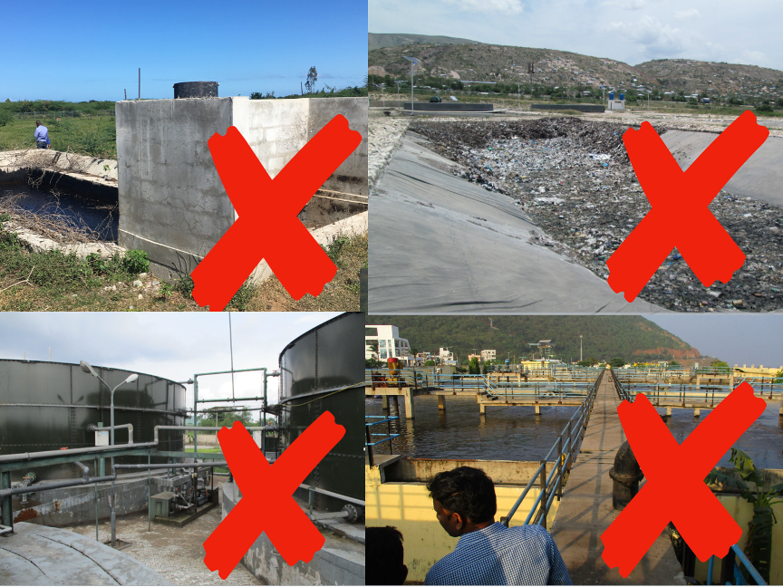

<script async defer data-domain="azores.io" src="https://plausible.io/js/plausible.js"></script>

```{r, echo=FALSE, preview=TRUE, fig.cap="Examples of failing waste treatment infrastructure, from Haïti, to Nigeria, to India: The norm, not the exception."}



```

## The bottleneck

Safe, functioning waste treatment infrastructure (or rather a lack thereof) is **the** bottleneck throttling the growth of safe sanitation systems in cities all over the world. Fast as lightning comes the popular response: "Aha! but what about safe sanitation *services*?! Its about *services*, not infrastructure". This is a fair response to be sure, but unless you are in the business of 'building for building's sake', just in order to satisfy some arbitrary project-focused results framework (and if you are working with infrastructure in the International Development WASH sector, this is likely the world you live in) then it should be pretty obvious that both infrastructure and *services* are needed; the whole raison d'être of waste treatment infrastructure is to anchor safe sanitation services (sewered or non-sewered), but there are no safe sanitation services without safe waste treatment infrastructure. Chicken, meet Egg. Therefore, addressing failing infrastructure is a good place to start when addressing failing sanitation systems, or (to re-emphasize my opening) it is **the** bottleneck. 

## The reasons 

So why is waste treatment infrastructure failing? The reasons typically run like this: Selection of technology inappropriate for the context; lack of operator training and capacity; an unserviceable OPEX burden on the utility; etc. etc. Digging a little deeper usually also exposes 'higher level' problems which may be expressed as "we didn't ask for this infrastructure, but they built it anyway and now we are expected to operate it". These 'higher level' problems represent failures in coordination, the influence of corruption, or the pervasive stubborn arrogance which scaffolds the deep architecture of those project-focused results frameworks. Oh yes, the reasons for that multi-million-dollar-stinking-cesspool-which-proffered-the-President's-first-photo-shoot-but-is-now-used-as a-solid-waste-dumpsite, go as deep as you like. And whether your work is in the technical, social, institutional, or financial realm, you'll find a plethora of good reasons that will all corroborate with each other. Lets have a look at some which are researched and published: 

WaterAid's excellent 2019 desk review^[WaterAid, 2019. Functionality of wastewater treatment plants in low-and middle-income countries - Desk review. https://washmatters.wateraid.org/sites/g/files/jkxoof256/files/functionality-of-wastewater-treatment-plants-in-low--and-middle-income-countries-desk-review_1.pdf. Accessed 2021-06-28.] on the "Functionality of wastewater treatment plants in low- and middle- income countries" provides a global summary of the situation including the amount of Official Development Assistance (ODA) money spent on waste treatment infrastructure ('over 1 billion USD a year, 22% of total ODA for WASH'), a snapshot of the scale of infrastructure either working ('In Brazil, most plants met effluent standards') or not working ('In Ghana, 80% of WWTPs were not working') and why ('A critical underlying cause is the institutional weaknesses and constraints to manage WWTPs sustainably, including low political priority; lack of recurrent finance for O&M; and inadequate knowledge, skills and systems for O&M'). Another 2019 study, by @klinger2019scoping from EAWAG, looked in detail at 23 Faecal Sludge Treatment Plants (FSTPs) from a total of 120+ from 13 countries in South Asia and Sub-Saharan Africa. The study was to inform the rapid scaling-up of FSTPs (especially in India) by learning lessons from failures, for which 5 'failure' areas were highlighted: Institutional recognition (i.e. political will); Knowledge on Quantities and Qualities (Q&Q) of faecal sludge; Capacity for operation; Design for operation; and Communication. 

The 2021 publication "Treatment technologies in practice: On-the-ground experiences of faecal sludge and wastewater treatment" by ISF-UTS and SNV^[ISF-UTS, SNV, 2021. Treatment technologies in practice. On-the-ground experiences of faecal sludge and wastewater treatment. https://snv.org/cms/sites/default/files/explore/download/2021-treatment-technologies-in-practice-snvisf-uts-full-publication.pdf. Accessed 2021-06-28.], provides yet more detail by presenting nine case studies of different treatment technologies in use in eight countries across Africa and Asia. The case studies provide an excellent overview of many of the technologies, which make up the suite of options for municipalities or utilities in LMICs. A couple of insights resonated with my own experiences, and those of WaterAid and EAWAG; decision-making is often 'pre-defined' by a development bank or NGO; and operational requirements are unknown. The 'on-the-ground' approach to presenting the challenging reality of operating waste treatment infrastructure was in part a response to the other reality of 'conference-level' success stories about innovation, circularity, and sustainability, which can create the impression of a prevailing success paradigm, when in fact what exists is a prevailing failure paradigm. 

Going back 6 years to 2015 with EAWAG's "Success and failure assessment methodology for wastewater and faecal sludge treatment projects in low-income countries" by @bassan2015 provides us with a tool to assess specific reasons for the success or failure of waste treatment infrastructure. The methodology was based upon 5 treatment plants in Senegal. 13 criteria were provided for the evaluation, of which 'Institutional autonomy' and 'Education in country' were ranked the highest in terms of influencing success or failure. The methodology highlighted the decision-making process as crucial in the success of treatment plants, with the most critical criteria identified at the technical level concerning the 'design studies and concepts during the early stages of project implementations'. Themes from the previously mentioned documents were again repeated here, such as the need for strong institutional and legal frameworks and competent institutions with independent funding. 

## Build first, ask questions later

From EAWAG's 2015 document, 'Institutional Autonomy' implies that 'projects and contracts can be defined without intensive bureaucracy at the state level' and 'political changes do not have too strong of an influence on the entire sanitation system'. SNV's 2021 publication suggests that this is often not the case, and that local decision makers are not empowered by status quo approaches to delivering waste treatment infrastructure in LMICs. 'Education in country' means 'training accessible for engineers and technicians in charge of the planning, design and construction of sanitation infrastructure', which was highlighted by both of the 2019 reports as missing in many cases, and therefore a main reason for treatment failure. So there we have it; a plethora of good reasons, technical, social, institutional and financial, that all corroborate with each other. We are left to conclude that failing waste treatment plants in LMICs is the norm, not the exception, but we do understand many of the reasons why. However, despite these great research publications, we're still not swimming in data about what is working and what isn't. 

Given that the risk of waste treatment infrastructure failure is sky high, how on earth do municipalities and utilities in LMIC contexts build a credible business case for waste treatment infrastructure implementation? I think the answer is; they don't, their donors decide for them. Donors provide national-level government with the CAPEX to build infrastructure that local-level government must operate. However, the 'infrastructure project' approach cannot satisfactorily address existing institutional constraints and weaknesses that will ultimately lead to infrastructure failure. There's a powerful 'Catch-22' situation here: On the one hand, we must continue to build waste treatment infrastructure because it is a bottleneck to growing a sanitation system (the risk averse 'do nothing' option is not palatable when faced with project drivers such as reducing water-related infant morbidity associated with unsafe sanitation), but on the other hand, we know that what we build will likely fail because of the weak enabling environment. So how do we wrestle free of this 'lose-lose' scenario? 

## Speak truth to power 

Lets be clear: This blog post is not intended to be comprehensive, and there are of course some examples of functioning waste treatment infrastructure in LMICs which deserve recognition. I argue that these cases are the exceptions that prove the existence of the rule. For all those searching for answers, I recommend starting with a thorough read of all of the documents referenced above, and then some more. Throughout the documents you'll find the expected blend of recommendations including 'emphasizing O&M', 'developing institutional and human resources capacity', 'establishing sanitation operator partnerships (SOPs)' and 'strengthening regulators'. You'll find the overarching call to embrace Citywide Inclusive Sanitation (CWIS) and use its principles to guide the planning, design, construction, and operation of assets. I recommend that you learn these lessons, know them like the back of your hand, and speak up when you see them being ignored. 

What I found to be missing from the documents are concrete recommendations for the integration of planning, design, construction and operation, and how these processes can be led by empowered local stakeholders and facilitated by innovative donor-level procurement and financing. Having researched this subject for years, and having more than my fair share of scar tissue borne out of my involvement in waste treatment infrastructure failures, I believe that this is where the digging stops; to understand why waste treatment infrastructure is failing, let us start with understanding how it is procured and financed by international donors. To achieve a higher rate of success, incentivize all stakeholders to deliver a higher quality of project. From the donors and their consultants to the utilities and their service providers, we are all accountable within the same complex ecosystem. We can all improve upon our coordination and how we communicate our challenges; donors need to improve on the gathering and sharing of evidence on the sustainability of the infrastructure they fund; utilities need to share reliable authentic data on treatment efficiencies; and regulators need to be brutally honest about their capacity to regulate and enforce. 

The writing is on the wall: We are failing badly when it comes to implementing waste treatment infrastructure. Procurement cycles are way too long and way too inefficient; built assets are not only unfit for purpose but they 'lock in' their sanitation systems to unsustainable development trajectories; and we are not capitalizing on the huge learning opportunities which these CAPEX interventions bring with them. 

Is anyone else is ready to commit to 'business as unusual'? Did I hear someone say, 'sanitation revolution'? 

To be continued ... 
